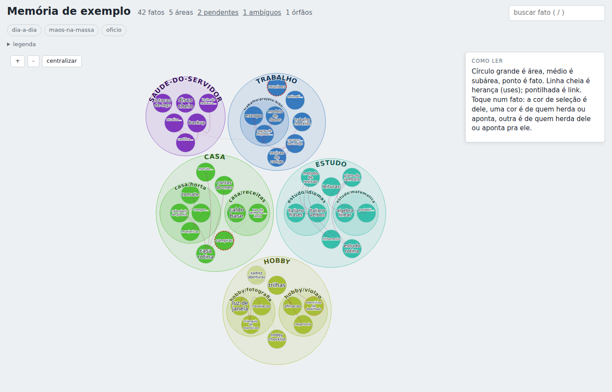

> English: [README.md](README.md)

# memoro


**Fato durável em markdown, uma porta de escrita, sem stack.** Um arquivo por fato, um mapa vivo,
recall por lente. Só biblioteca padrão do Python (3.9+): sem banco, sem serviço, sem `pip install`.

Não é um diário automático da sessão. É o lugar em que um fato tem de entrar por uma porta (recusa
segredo, quase-duplicata, referência vazia) e sair como um `.md` que o `git log` explica.

## O que é, o que não é

| quer | use | não use memoro |
|---|---|---|
| "este repo usa pnpm", um jeito só, recusa se vier podre | **memoro** | AGENTS.md (cabe no contexto e dois agentes inventam duas regras) |
| mapa do que o agente sabe, em arquivos | **memoro** | Obsidian, se o humano é quem edita o dia todo |
| capturar sozinho o que aconteceu na sessão | [claude-mem](https://github.com/thedotmack/claude-mem) | memoro não tem hook de sessão |
| lembrar o cliente de um produto, com LLM | [Mem0](https://docs.mem0.ai/) | memoro não extrai fato de chat |
| o teste prova que o patch conserta | [erratum](https://github.com/victorandraad/erratum) | memoro não é ledger de erro |

## Instalar

Python 3.9+, Unix (Linux, macOS, WSL). A tranca usa `fcntl`.

```sh
git clone https://github.com/victorandraad/memoro.git
cd memoro
export PYTHONPATH="$PWD"
python3 -m memoro init          # cria ~/memoro; mude com MEMORO_HOME=/outro/lugar
python3 -m unittest
```

Comando global (opcional):

```sh
pipx install git+https://github.com/victorandraad/memoro.git
```

## Contribuir

PRs são bem-vindos. Teste que falha primeiro. Fixture sempre fictícia (`casa`, `estudo`, `hobby`).

```sh
python3 -m unittest
```

O que ajuda: um caso em que a porta deixou passar duplicata, um `doutor` mudo, um recall que
carregou demais. Detalhes em [CONTRIBUTING.md](CONTRIBUTING.md).

## Licença

[GPL-3.0-or-later](LICENSE). Pode usar, modificar e distribuir. Se distribuir um derivado, o código
dele também fica sob a GPL: a ideia continua pública. Código de terceiro (mapa) em
[LICENCAS-DE-TERCEIROS.md](LICENCAS-DE-TERCEIROS.md).



```sh
python3 -m memoro mapa --servir      # http://127.0.0.1:8765, regenera quando um .md muda
```

Cor é área; tracejado vermelho é referência pendente, pontilhado âmbar é ambígua; clique num fato
pra ver de quem ele herda e quem herda dele. Um `index.html` só, abre offline. Detalhes em
[docs/mapa.md](docs/mapa.md). O dado da imagem é fictício (`demo/`).

## Os cinco comandos do dia a dia

```sh
# 1. guardar: o corpo vem do stdin
echo "débito automático, vence todo dia 10" | python3 -m memoro add casa conta-de-luz --desc "conta de energia"

# 2. corrigir
python3 -m memoro update casa/conta-de-luz --desc "conta de energia, no débito"
echo "trocou de titular em 2031" | python3 -m memoro update conta-de-luz --anexar

# 3. lembrar só o que serve à decisão
python3 -m memoro recall --lens dia-a-dia
python3 -m memoro recall --scope casa/cozinha --saltos 2 --json

# 4. ver
python3 -m memoro ls casa
python3 -m memoro show casa/conta-de-luz

# 5. aposentar, com motivo
python3 -m memoro rm casa/conta-de-luz --motivo "mudei de casa"
```

E ainda: `mapa`, `doutor`, `adotar-tudo`, `log [--id X] [--recusas] [--desde AAAA-MM-DD]`,
`purga [--dias 30]`. Todo comando aceita `--json`. Saída `0` deu certo, `1` a porta recusou ou o
doutor achou algo (o motivo vai pro stderr e pro diário), `2` uso errado.

A saída sai em inglês por padrão. `MEMORO_LANG=pt` põe toda mensagem em português (recusas, recall,
doutor, help). Comandos e flags valem nas duas línguas (`--motivo`/`--reason`,
`--novo-mesmo-assim`/`--new-anyway`). Script lê `--json`: as chaves não mudam com a língua.

## A porta única, e por quê

Memória que qualquer processo edita do jeito que quer apodrece em silêncio: fato duplicado, segredo
colado, referência pro vazio. Aqui **toda escrita passa por uma porta**, que:

- **valida**: segredo por regex de alta confiança, área inexistente, relação desconhecida, `uses`
  pro vazio, nome duplicado na área, quase-duplicata (`parecido com <id>`: use `update`, ou
  `--novo-mesmo-assim`), motivo obrigatório no `rm`;
- **grava de forma atômica**, sob tranca de arquivo, com `fsync`;
- **registra no diário** (`eventos.jsonl`, append-only) cada operação com o hash do conteúdo,
  **inclusive as recusas**: dá pra ver o que tentaram gravar e por que não entrou;
- **não apaga**: `rm` move pra `areas/_lixeira/` com motivo e data; `purga` apaga o que venceu;
- **commita**, se a raiz for um repo git: um commit por escrita, só do que tocou, com o evento do
  diário no mesmo commit (o evento é gravado antes; commit que falha deixa o evento e o doutor acusa).

O formato do fato e cada recusa, com exemplos que a suíte confere: [SPEC.md](SPEC.md).

### O doutor: porta única sem usuário unix dedicado

Impor a porta por permissão de sistema (usuário próprio + sudo) não generaliza. O `memoro` confere
depois, contra o diário:

```sh
python3 -m memoro doutor [--json]     # exit 0 limpo, 1 com achado
```

Todo `.md` de `areas/` tem de bater com o hash do último evento ok daquele id. O doutor acusa
(1) arquivo alterado fora da porta, (2) arquivo sem evento de criação, (3) evento sem arquivo,
(4) frontmatter inválido, (5) referência pendente ou ambígua, (6) linha corrompida no diário,
(7) git contra diário: se a raiz é repo git, todo evento de escrita ok tem o commit
`memoro <op> <id>` e todo commit desses tem o evento (`evento-sem-commit`, `commit-sem-evento`).
Fora de repo git, (7) pula.

Quer editar no editor? Pode, e depois regulariza com motivo (passa pelas mesmas regras da porta e
vira evento `adocao`):

```sh
python3 -m memoro doutor --adotar casa/rotina --motivo "reescrevi no editor"
```

## Id por área: homônimo e ambíguo

**Área = pasta** (`areas/<area>[/<subarea>]/<nome>.md`, no máximo um nível de subpasta) e o id é
qualificado por ela. `casa/rotina` e `estudo/rotina` são dois fatos, os dois endereçáveis; no mapa
aparecem com o rótulo qualificado.

Quando alguém cita só `rotina` (`uses: [rotina]` ou `[[rotina]]` no corpo):

1. se existe `rotina` **na área de quem cita**, é essa;
2. senão, se existe **uma só** no repositório, é essa;
3. se existe em duas áreas alheias (`hobby/violao` citando `rotina`, que mora em `casa/` e em
   `estudo/`), a referência é **ambígua**: fica reportada com as candidatas, aparece no `doutor`, no
   mapa e como aviso da porta, e **não é resolvida no chute**. Conserto: qualificar, `[[casa/rotina]]`.

`uses` aceita relação tipada: `--uses detalha:casa/gas,contradiz:forno` (`regra-de`, `depende-de`,
`substitui`, `contradiz`, `detalha`, `dono-de`; sem prefixo é herança).

## Lentes e recall

`lentes.json` mapeia um nome de consumidor pra uma lista de escopos:
`{"dia-a-dia": ["casa", "estudo"], "oficio": ["trabalho"]}`. `recall --lens oficio` devolve os fatos
do escopo, os filhos e o que eles herdam por `uses` (até `--saltos N`), **dizendo por que cada um
entrou**. `MEMORO_RECALL_CAP=40` põe um teto; o que ficou de fora é contado na saída. É o que impede
o agente de carregar a memória inteira pra responder uma pergunta.
`recall --list-lenses` (ou `--json`) lista as lentes e seus escopos, pro agente descobrir qual pedir.

## Usar com agente de IA

O agente lê por `recall` e escreve pela porta. [docs/usar-com-ia.md](docs/usar-com-ia.md) traz o
bloco pronto pra colar em `CLAUDE.md`/`AGENTS.md` e o **hook de guarda** do Claude Code
(`hooks/guarda_da_porta.py`), um `PreToolUse` que nega `Edit`/`Write` direto em
`$MEMORO_HOME/areas/` e ensina o comando certo. O hook cobre as ferramentas de edição; o `doutor`
cobre o resto.

## Importar uma pasta de markdown que já existe

Ponha os arquivos em `areas/<area>/<nome>.md` com o frontmatter mínimo (`name`, `description`,
`area`) e rode:

```sh
python3 -m memoro adotar-tudo --motivo "importei minhas notas de 2030"
```

Cada fato é validado pelas mesmas regras da porta e registrado no diário. O que não passa (segredo
no texto, frontmatter inválido) é **listado, nunca apagado**; conserte e rode de novo.

## A raiz

```
$MEMORO_HOME/            (padrão: ~/memoro)
  areas/<area>/<nome>.md   frontmatter: name, description, area, e opcionais uses, scope
  areas/_lixeira/
  lentes.json
  eventos.jsonl            ts, usuario, op, id, area, resumo, ok, motivo, hash_do_conteudo
  .memoro/mapa/            saída padrão do `memoro mapa`
```

## O que isto não é

- **Não tem embeddings** na v1. Recall é por escopo, herança e link: explicável, determinístico.
- **Não tem servidor.** O `--servir` do mapa é um leitor local em loopback, opcional.
- **Não faz merge automático por LLM.** Fato parecido é recusado com o id do parecido, homônimo
  ambíguo é reportado: **falha visível em vez de junção silenciosa**.
- Não é banco, nem wiki, nem sincronizador. É uma pasta de markdown com regras na entrada.

## Limites honestos

- A tranca usa `fcntl`: **só Unix** (Linux, macOS, WSL).
- Escala medida com fatos sintéticos (20 áreas, metade com dois `uses`), num servidor pequeno:

  | operação | 1.000 fatos | 10.000 fatos |
  |---|---|---|
  | `recall --lens` | 0,18 s | 1,23 s |
  | `recall --scope` | 0,13 s | 1,09 s |
  | `mapa` (gerar) | 0,24 s | 7,06 s |
  | `doutor` | 0,12 s | 1,08 s |
  | `adotar-tudo` (importar tudo) | 0,45 s | 4,33 s |
  | `add` de um fato | 0,17 s | 1,13 s |

  Tudo relê a pasta a cada comando (não há índice nem cache): o custo é linear no número de fatos.

  O `index.html` do mapa cresce ~0,35 KB por fato (405 KB com 1.000; 3,4 MB com 10.000) e o navegador
  desenha 10.000 círculos, mas já não é um mapa que se lê: acima de uns 2.000 fatos, gere por área.
- Nome solto (`[[rotina]]`) resolve por varredura linear; qualifique (`[[casa/rotina]]`) em acervo
  grande.
- A detecção de segredo é por regex de alta confiança: pega token com formato conhecido, não pega
  senha em texto corrido.

## Desenvolver

```sh
python3 -m unittest
```

Veja [CONTRIBUTING.md](CONTRIBUTING.md). Licença [GPL-3.0-or-later](LICENSE); código de terceiro em
[LICENCAS-DE-TERCEIROS.md](LICENCAS-DE-TERCEIROS.md).
